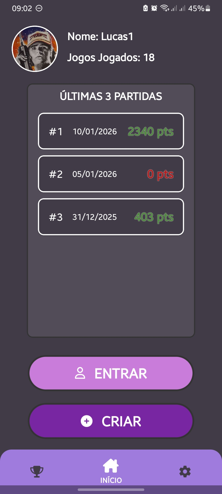
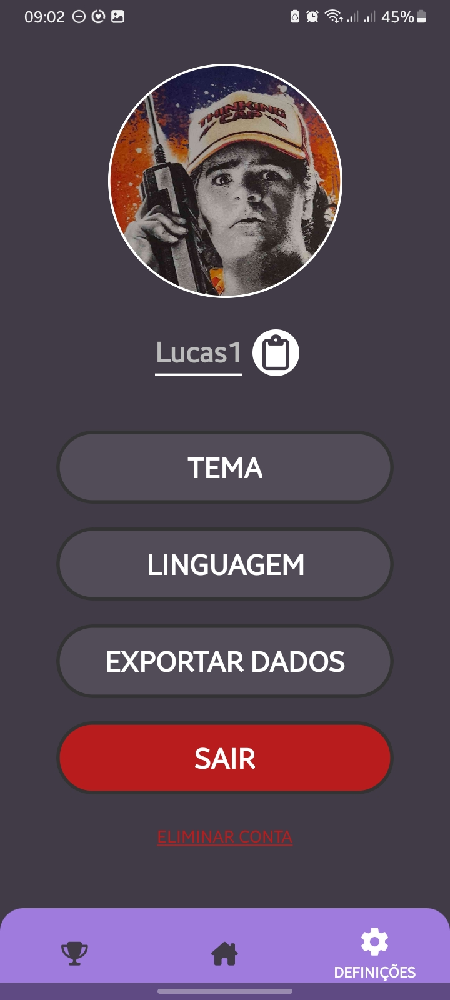
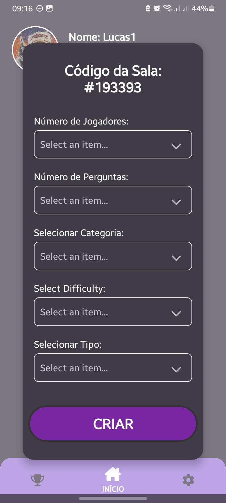
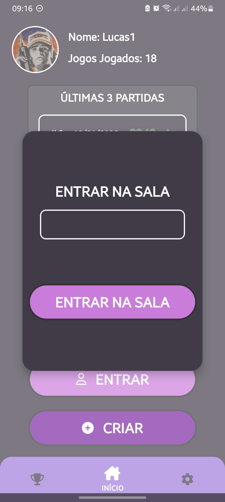

# Challengers 🏆

<div align="center">
<a href="README.pt.md">Leia em Português</a> | <a href="#">Read in English</a>
</div>
<div align="center">

</div>


**Challengers** is a **multiplayer quiz game** designed to maximize **knowledge** while you **have fun** with your friends!

A **complete solution** for fun without procrastination, available for Android, iOS and web.


## 📸 Screenshots

| Login                                             | Homepage                                                  | Settings                                                |
|---------------------------------------------------|-----------------------------------------------------------|---------------------------------------------------------|
|  |  |  |

| Leaderboard                                          | Create Game Room                                    | Join Game Room                                  |
|------------------------------------------------------|-----------------------------------------------------|-------------------------------------------------|
|  |  |  |

## 🚀 Features

- ✅ Realtime Multiplayer Game
- ✅ Customizable user data
- ✅ User-specific and global leaderboard
- ✅ Customizable game rooms (number of players, questions, category, difficulty and type)
- ✅ Join a room with your friends
- ✅ Authentication via token (UUID)
- ✅ Export your data in JSON format

## 🔧 Technologies Used

- **Expo SDK** - Main platform
- **React Native** - Cross-platform UI framework
- **expo-router** - File-based routing system
- **Redux Toolkit** - Global application state management
- **Supabase** - Real-time synchronization and data persistence
- **restDB** - Data persistence
- **i18next** - Internationalization of application screens
- **TypeScript** - Main programming language
- **MMKV** - High performance local persistence
- **expo-secure-store** - Secure storage of sensitive data
- **React Native Reanimated** - Animations for React Native elements
- **GitHub Actions** - CI/CD pipeline
- **react-native-view-shot** - Component image capture
- **Open Trivia DB** - Database provider of questions and answers
- **LibreTranslate** - Translation of questions and answers from Open Trivia DB

## ⚙️ Install the Application

### Android 💚
1. Go to "[Releases](https://github.com/8126Lucas/DSSMV_ProjectReact_1241131_1241008/releases)" on the official GitHub page
2. Download the latest version (.apk)
3. Install Challengers from the download

### iOS 🍎
1. Go to "[Releases](https://github.com/8126Lucas/DSSMV_ProjectReact_1241131_1241008/releases)" on the official GitHub page
2. Download the latest version (.ipa)
3. Install AltStore
4. Install Challengers from AltStore

## 💾 Self-Host Challengers
1. Clone the repository:
```bash
git clone https://github.com/8126Lucas/DSSMV_ProjectReact_1241131_1241008.git
```
2. Start a project on restDB
3. Start a project on Supabase
4. Create the tables in Supabase (disable RLS and enable Realtime on all tables):
```sql
-- rooms
create table public.rooms (
  id bigint generated by default as identity not null,
  created_at timestamp with time zone not null default now(),
  questions json null,
  room text not null,
  constraint rooms_pkey primary key (id)
) TABLESPACE pg_default;

-- in_game_answer_state
create table public.rooms (
  id bigint generated by default as identity not null,
  created_at timestamp with time zone not null default now(),
  questions json null,
  room text not null,
  constraint rooms_pkey primary key (id)
) TABLESPACE pg_default;

-- question_translation_bank
create table public.rooms (
  id bigint generated by default as identity not null,
  created_at timestamp with time zone not null default now(),
  questions json null,
  room text not null,
  constraint rooms_pkey primary key (id)
) TABLESPACE pg_default;
```
5. Create a CORS API key on restDB
6. Create the `.env` file in the project root directory
```bash
EXPO_PUBLIC_SUPABASE_URL=...
EXPO_PUBLIC_SUPABASE_API=...
EXPO_PUBLIC_RESTDB_API_MOBILE=...
EXPO_PUBLIC_RESTDB_API_WEB=...
```
7. Create the `env.d.ts` file in the same directory
```ts
declare namespace NodeJS {
    interface ProcessEnv {
        EXPO_PUBLIC_SUPABASE_URL: string;
        EXPO_PUBLIC_SUPABASE_API: string;
        EXPO_PUBLIC_RESTDB_API_MOBILE: string;
        EXPO_PUBLIC_RESTDB_API_WEB: string;
    }
}
```
8. Now everything is ready!

## 📁 Project Structure
```bash
DSSMV_ProjectReact_1241131_1241008/
├── .github/workflows/
├── app/
│   ├── (tabs)/
│   │   ├── home/
│   │   ├── leaderboard/
│   │   ├── settings/
│   │   └── _layout.tsx
│   ├── game/
│   ├── login/
│   ├── waiting_room/
│   ├── _layout.tsx
│   └── index.tsx
├── components/
│   ├── game/
│   ├── homepage/
│   ├── leaderboard/
│   ├── settings/
│   └── ...
├── assets/
│   ├── images/
│   └── screenshots/
├── constants/
├── hooks/
├── src/
│   ├── flux/
│   ├── foreign/
│   ├── i18n/
│   │   ├── translations/
│   │   │   ├── en.json
│   │   │   ├── es.json
│   │   │   └── pt.json
│   │   └── index.tsx
│   └── types
├── .env
├── app.json
├── env.d.ts
└── package.json
```

## ⚠️ Known Issues

- The context of the trivia translations isn't the best

## 🛠️ Troubleshooting

Any problem you encounter while using Challengers, open an [issue](https://github.com/8126Lucas/DSSMV_ProjectReact_1241131_1241008/issues) on the official GitHub page and we will try to solve it by the next version.

## 👥 Authors
- [**Lucas Santos**](https://github.com/8126Lucas) - Full application development
- [**Miguel Silva**](https://github.com/miguelsiilva1) - Full application development

## 🤝 How to Contribute

1. Fork the project
2. Create a branch for your feature (`git checkout -b feature/new-feature`)
3. Commit your changes (`git commit -am 'Add new feature'`)
4. Push to the branch (`git push origin feature/new-feature`)
5. Open a Pull Request
